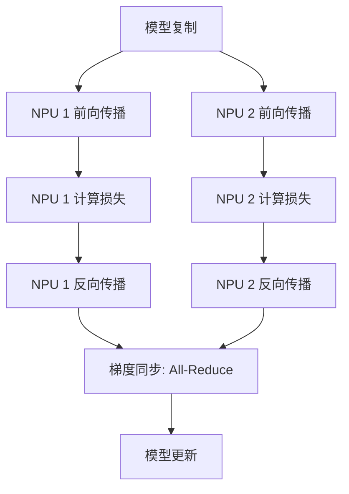
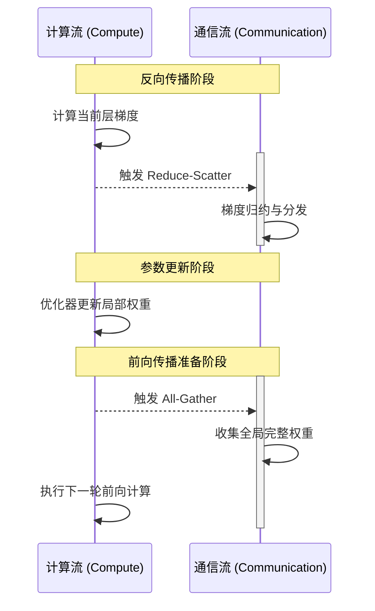
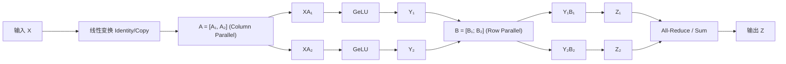
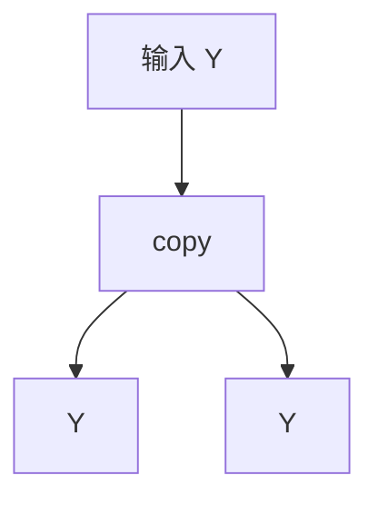
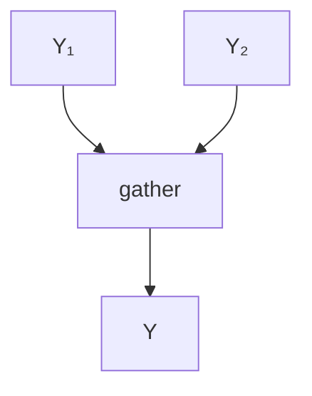
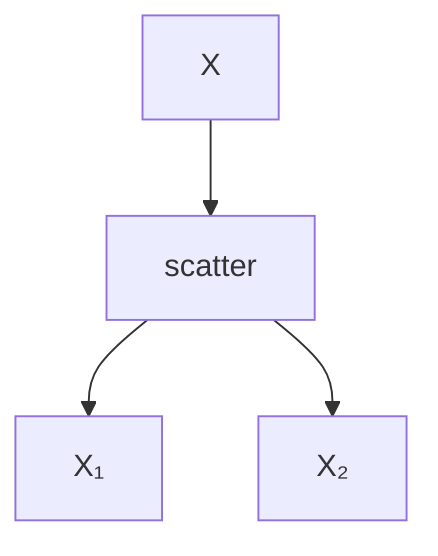
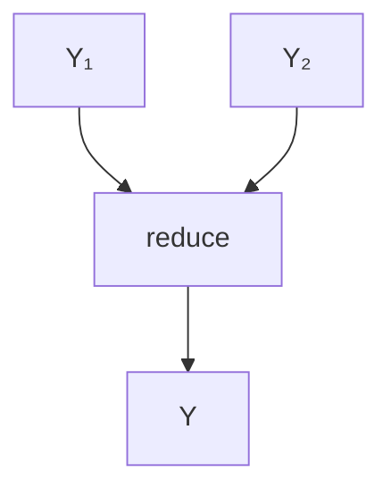

# 大规模模型并行训练技术详解

# 数据并行（Data Parallelism, DP）

## 1. 概述

**数据并行 (Data Parallelism)** 是分布式训练中最基础且应用最广泛的并行策略。其核心思想是将训练数据集切分为多个分片（Shards），分发到不同的计算设备（如 GPU/NPU）上。每个设备保存一份完整的模型副本，独立执行前向与反向传播，随后通过集合通信（Collective Communication）同步梯度，从而实现训练速度的近线性加速。

## 2. 基础架构与训练流程

在分布式训练过程中，每个进程（Process）独立执行前向和反向传播计算。由于各节点处理的数据分片不同，产生的梯度也不同，因此需要通过通信操作进行同步。

- **参数与梯度同步**：通常采用 `All-Reduce` 操作。该操作会对所有设备上的梯度进行归约（如求平均值），确保在模型更新阶段，所有节点使用的梯度完全一致。
- **Bucket 机制**：为了提高通信效率，通常将多个参数的梯度组合成 `Bucket`（桶），分批进行通信以掩盖网络延迟。

### 2.1 梯度同步原理

在标准的数据并行中，各进程（Process）之间的参数与梯度关系如下：

```Plaintext
      Process 0 (Rank 0)                     Process 1 (Rank 1)
┌───────────────────────────┐          ┌───────────────────────────┐
│   Model Weights (W)       │          │   Model Weights (W)       │
│   Local Gradients (g0)    │          │   Local Gradients (g1)    │
└─────────────┬─────────────┘          └─────────────┬─────────────┘
              │                                      │
              └───────────────► All-Reduce ◄─────────┘
                             (Sum / Average)
                                     │
              ┌──────────────────────┴──────────────────────┐
              ▼                                             ▼
    Synced Gradient (G)                           Synced Gradient (G)
    G = (g0 + g1) / 2                             G = (g0 + g1) / 2
```

### 2.2 标准训练流水线

数据并行的典型迭代过程如下：



> 补充说明：
>
> 在 $T$ 时刻，各设备同步后的梯度 $\bar{G}$ 可表示为：
>
> $$\bar{G} = \frac{1}{N} \sum_{i=0}^{N-1} g_i$$
>
> 其中 $N$ 为并行设备数，$g_i$ 为第 $i$ 个设备计算出的局部梯度。


## 3. 分布式优化器与通信重叠

为了进一步提升吞吐量并降低显存占用，现代深度学习框架（如 Megatron-LM）引入了分布式优化器（Distributed Optimizer）和通信重叠技术，其核心逻辑与 ZeRO-1/2 优化器类似。

### 3.1 核心优化配置

- `--use-distributed-optimizer`：
  - **分布式优化器**。将优化器状态（如 Adam 的一阶矩 $m$ 和二阶矩 $v$）均匀切分到各个 DP 进程中。每个设备仅维护和更新其负责的那部分参数，从而将优化器显存占用降低为原来的 $1/N$。
- `--overlap-param-gather`：
  - **参数收集重叠**。在前向传播需要完整参数时，提前启动 `All-Gather` 通信，使其与计算任务并行。
- `--overlap-grad-reduce`：
  - **梯度规约重叠**。在反向传播计算每一层梯度时，立即触发该层梯度的通信，无需等待所有层计算完毕。

### 3.2 计算流与通信流的并行化（Overlapping）

通过将计算与通信异步化，可以最大限度地压榨硬件性能：

1. 反向计算与 Reduce-Scatter 并行：

   在反向传播计算梯度的过程中，系统利用通信后端启动 Reduce-Scatter 操作。该操作在归约梯度的同时，将结果分散到负责对应分片的设备上。

   $$
   g_{local} \xrightarrow{Reduce-Scatter} G_{partitioned}
   $$

2. 局部参数更新：

   每个设备仅针对自己负责的参数分片进行更新。由于优化器状态也是切分的，这一步显著减少了显存峰值。

3. All-Gather 与前向计算并行：

   在下一轮前向传播开始前，通过 All-Gather 重新聚合完整的权重参数 $W$。通过流水线设计，这一过程可以和前向传播任务重叠执行。

### 3.3 优化后的逻辑时序



## 4. 总结与对比

| **特性优化**     | **传统 Data Parallel (DP)**           | **分布式优化器 (Distributed DP)**    |
| ---------------- | ------------------------------------- | ------------------------------------ |
| **参数同步方式** | `All-Reduce` (全量同步)               | `Reduce-Scatter` + `All-Gather`      |
| **显存占用**     | 高（每个设备保存完整模型+优化器状态） | **极低**（优化器状态在设备间切分）   |
| **通信耗时**     | 通信与计算串行，等待延迟高            | **掩盖延迟**（计算与通信高度重叠）   |
| **适用场景**     | 小型模型、显存充足                    | 大规模预训练（如 Llama, GPT 级模型） |

**核心价值**：分布式优化器通过**显存换空间、通信换时间**的策略，不仅突破了单一设备显存对模型规模的限制，还通过 overlap 技术实现了近乎完美的硬件利用率。


# 流水并行（Pipeline Parallelism, PP）

## 1. 概述

**流水并行（Pipeline Parallelism, PP）** 是一种模型并行技术，旨在将 Transformer 模型等深度神经网络的层（Layers）横向切分并分布到不同的计算设备（Device）上。其核心逻辑是将数据处理过程划分为多个连续的阶段（Stages），使数据在不同设备间流动，完成前向传播与反向传播。

> ✅ **核心目标**：通过分层部署**降低单设备静态显存（Static Memory）占用**，从而支持超大规模参数模型的训练。

## 2. 关键概念解析

### 2.1 流水线模型并行分区（Pipeline MP Partition）

整个网络按层被划分为 $L$ 个子集，每个子集构成一个 **Pipeline Stage**。每个物理设备负责处理一个或多个 Stage 内部的计算任务（如连续的若干个 Transformer Blocks）。

### 2.2 张量模型并行分区（Tensor MP Partition）

在 Pipeline Stage 内部，通常会结合 **张量并行（Tensor Parallelism, TP）**。

- **实现方式**：将单个算子（如矩阵乘法 $Y = XW$）的参数矩阵 $W$ 切分到多个设备上。
- **协同关系**：PP 解决的是“层与层之间”的分布，而 TP 解决的是“层内部”的切分。

## 3. 1F1B 调度与训练流程分析

在流水并行中，为了提高效率并控制显存峰值，通常采用 **1F1B（One Forward, One Backward）** 调度策略。一个完整的训练迭代（Iteration）包含以下四个关键阶段：

### 3.1 微批次计算准备（Compute Micro-batches）

将一个 Global Batch 划分为 $m$ 个更小的 **Micro-batch**。

- **目的**：Micro-batch 是流水线调度的最小单位，能够让后续阶段尽早开始计算，减少阻塞。

### 3.2 前向预热阶段（Warmup Forward Pass）

第一个 Micro-batch 从第一阶段进入，随后后续 Micro-batch 依次跟进。在此阶段，系统只进行前向传播，直到最后一个 Stage 开始接收数据。

### 3.3 稳态阶段（1F1B Steady State）

这是流水线效率最高的部分。设备在完成一个 Micro-batch 的前向传播（Forward）后，立即执行另一个已完成前向传播的 Micro-batch 的反向传播（Backward）。

- **核心优势**：前向与反向计算交替重叠，保持了设备的高负载，并能及时释放不再需要的激活值显存。

### 3.4 反向冷却阶段（Cooldown Backward Pass）

当所有前向任务完成后，系统进入扫尾阶段，依次完成剩余 Micro-batch 的反向传播。

## 4. 模式对比：无交错 vs. 带交错

### 4.1 无交错模式（Without Interleaving）

在非交错模式下，每个设备负责一个连续的层分区（例如，Device 1 负责第 1-4 层）。

- 流水线气泡（Pipeline Bubble）：

  在预热和冷却阶段，设备会出现空闲等待。对于 $p$ 个流水线阶段，其气泡占比公式为：
  $$
  Bubble \approx \frac{p - 1}{m}
  $$
  其中 $p$ 为流水线阶段数，$m$ 为 Micro-batch 数量。

- **使能参数**：`--pipeline-model-parallel-size N`

### 4.2 带交错模式（With Interleaving / Virtual Pipeline）

为了进一步压缩气泡，引入了**虚拟流水线（Virtual Pipeline）**概念。每个设备不再负责一个连续的大块，而是负责多个较小的虚拟阶段（Virtual Stages）。

- 优化原理：

  如果 Device 1 负责第 1-2 层和第 9-10 层，那么它可以在处理完第 1-2 层后，不必等到所有阶段都结束，而是更早地切入后续层的计算。

- 气泡压缩公式：

  若虚拟阶段数为 $v$，则气泡时间优化为：
  $$
  Bubble \approx \frac{p - 1}{v \cdot m}
  $$
  其中 $v$ 为虚拟并行因子。

- **使能参数**：

  ```bash
  --pipeline-model-parallel-size N
  --num-layers-per-virtual-pipeline-stage M
  ```

## 5. 核心优势与挑战总结

| **维度**     | **描述**                                                     |
| ------------ | ------------------------------------------------------------ |
| **显存优化** | 显著减少静态显存占用，每个设备仅需存储 $1/p$ 的模型参数。    |
| **扩展性**   | 是实现千亿/万亿级模型训练的核心技术（通常与 TP、DP 组成 3D 并行）。 |
| **主要瓶颈** | **流水线气泡**：硬件利用率无法达到理论 100%；**通信开销**：Stage 间的激活值传输。 |


# 张量并行（Tensor Parallelism, TP）

## 1. 概述

**张量并行 (Tensor Parallelism)** 是一种模型并行策略，其核心思想是将 Transformer 层的权重矩阵和计算任务切分到多个计算设备（GPU）上。与数据并行（Data Parallelism）不同，TP 旨在通过分布式计算单个算子来解决单卡显存无法承载超大规模模型的问题。

### 核心目标

- **降低静态显存占有**：将参数矩阵 $W$ 切分并分布在 $N$ 个设备上，单设备仅需存储 $1/N$ 的权重。
- **减少单机激活显存**：通过并行计算，中间激活值（Activations）也在设备间分摊。
- **支持超大规模参数规模**：突破单卡显存瓶颈，支持千亿乃至万亿级参数量模型的分布式训练与推理。

> ✅ **适用场景**：Transformer 架构中参数密集的线性层（Linear Layers），特别是多头注意力（Self-Attention）与前馈网络（MLP）模块。

## 2. MLP 层的张量并行实现

在 Transformer 的 MLP 块中，通常包含两个线性层：

1. **第一个线性层**：权重为 $A$，配合激活函数（如 GeLU）。
2. **第二个线性层**：权重为 $B$。

为了最小化通信开销，通常采用 **行并行（Row Parallelism）** 与 **列并行（Column Parallelism）** 结合的策略。

### 并行逻辑流程



#### 关键技术细节：

- **列并行（Column Parallelism）**：

  - 对权重矩阵 $A$ 按列切分为 $A = [A_1, A_2]$， 分别位于两个设备。
  - 计算过程：每个设备计算 $Y_i = \text{GeLU}(X A_i)$。
  - *补充说明*：此处无需通信，因为 GeLU 是逐元素（Element-wise）操作，各设备可独立完成。

- **行并行（Row Parallelism）**：

  - 对矩阵 $B$ 按行切分为 $B = \begin{bmatrix} B_1 \\ B_2 \end{bmatrix}$。
  - 计算过程：每个设备持有 $Y_i$，计算 $Z_i = Y_i B_i$。

- **算子融合与通信控制**：

  - 在 MLP 层的最后，通过 All-Reduce 操作将各设备的 $Z_i$ 进行累加：

    $$Z = Z_1 + Z_2 = Y_1 B_1 + Y_2 B_2$$

  - 该方案将通信次数压缩至最低（每个 Transformer 层仅需两次 All-Reduce：一次在 MLP，一次在 Attention）。

## 3. 关键通信算子解析

在底层实现（如 NVIDIA NCCL）中，张量并行依赖以下四种基本通信原语：

### **1. **`copy`**：数据复制**



- **用途**：将输入复制到多个设备，用于共享数据；
- **特点**：无计算，仅复制。

### **2. **`gather`**：数据合并**



- **用途**：合并分布式的输出（如 MLP 前向输出）；
- **特点**：从多设备收集，形成完整张量。

### **3. **`scatter`**：数据分散**



- **用途**：将输入切分后分发到多个设备；
- **特点**：实现输入并行处理。

### **4. **`reduce`**：梯度归约**



- **用途**：聚合梯度或中间结果；
- **特点**：常用于反向传播。

### 3.3 核心算子对比表

| **算子 (Primitive)** | **功能描述**                     | **典型应用场景**                               |
| -------------------- | -------------------------------- | ---------------------------------------------- |
| **Scatter**          | 将完整张量切分并分发至各设备     | 输入数据（Input Data）的初步并行化切分         |
| **Gather**           | 将各设备的局部张量拼接为完整张量 | 输出层获取完整预测概率分布                     |
| **All-Gather**       | 所有设备收集其他所有设备的数据   | 列并行中需要完整激活值进行后续计算时           |
| **All-Reduce**       | 跨设备求和/求均值并同步结果      | **TP 最核心操作**：MLP 和 Attention 的输出聚合 |

## 4. 优势与挑战分析

### ✅ 技术优势

1. **显存利用率最大化**：静态权重、梯度、优化器状态以及激活值均被有效分摊。
2. **极高计算效率**：在大带宽互联（如 NVLink）环境下，TP 能显著提升超大模型的吞吐量。
3. **架构通用性**：可与数据并行（DP）和流水线并行（PP）无缝结合，构成 **3D 并行** 方案。

### ⚠️ 实现挑战

1. **通信敏感性**：TP 的通信频率远高于 DP，对节点内带宽（Intra-node bandwidth）要求极高。通常建议 TP Size 不超过单机 GPU 数量。
2. **算子对齐限制**：矩阵的维度必须能被 TP Size 整除（例如隐藏层维度 $d_{model}$ 必须是 $N$ 的倍数）。

## 5. 配置与使能

在主流分布式训练框架（如 Megatron-DeepSpeed）中，可以通过命令行参数轻松配置 TP：

```bash
# 示例：设置张量并行大小为 8（通常对应单机 8 卡）
--tensor-model-parallel-size 8 \
--pipeline-model-parallel-size 1 \
--data-parallel-size 4
```

- `tensor-model-parallel-size N`：定义了横向切分模型的程度。
- 当 `N=2` 时，对于一个 $4096 \times 4096$ 的权重矩阵，每张显卡将仅承载 $4096 \times 2048$ 的部分。


# 序列并行（Sequence Parallelism, SP）

## 1. 序列并行概述

**序列并行 (Sequence Parallelism)** 是一种针对 Transformer 架构中非线性层（如 LayerNorm 和 Dropout）的并行策略。它与张量并行（TP）协同工作，旨在解决长序列（Long Sequence）训练时，激活值显存占用随序列长度 $sequence\_length$ 线性增长的问题。

### 核心动机

在标准的 TP 中，虽然线性层（MLP/Attention）被切分了，但 **LayerNorm** 和 **Dropout** 依然会在每个设备上对全量序列数据进行计算和存储。SP 的核心思想是将原本在序列维度（Sequence Dimension）冗余的计算进行切分：

- **计算层面**：各设备仅负责处理 $s/N$ 长度的子序列。
- **显存层面**：避免了在单卡上存储完整的中间激活值。

## 2. 架构图解与执行流程

序列并行将一个 Transformer Block 的执行划分为三个阶段，通过改变数据的分布方式（Layout）来平衡计算与通信。

### 2.1 阶段一：输入侧序列并行（Sequence Parallel）

输入张量 $X$ 在序列维度被均匀切分为 $[X_1, X_2]$，分布在不同的 Rank 上。

- **LayerNorm 计算**：每个 Rank 仅对本地子序列进行归一化。
  - *技术细节*：由于 LayerNorm 是沿隐藏层维度（Hidden Dimension）做归一化，子序列之间互相独立，因此**无需跨设备通信获取全局均值和方差**。
- **通信算子**：使用 All-Gather 将切分的序列恢复为完整序列，以进入后续的张量并行计算。

### 2.2 阶段二：核心计算（Tensor Parallel）

此阶段采用标准的张量并行（混合行并行与列并行）：

1. **列并行（Column Parallel）**：计算 $\text{GeLU}(XA_i)$。
2. **行并行（Row Parallel）**：计算 $Z_i = Y_i B_i$。

- **状态转换**：此阶段结束后，每个 Rank 持有部分计算结果（Partial Sum）。

### 2.3 阶段三：输出侧序列并行（Sequence Parallel）

- **通信算子**：使用 Reduce-Scatter  操作。该操作将各 Rank 的部分和进行累加，同时将结果按序列维度重新切分回各个 Rank。
- **Dropout 计算**：每个 Rank 仅在本地切分后的数据上应用 Dropout。

## 3. 关键机制与通信开销分析

理解 SP 的核心在于认识到它并没有增加物理上的通信量，而是将原有的通信进行了“拆解”与“重组”。

### 3.1 通信成本等价性分析

在纯张量并行（TP）中，每个 Block 通常需要两次 All-Reduce。根据 Ring All-Reduce 算法：
$$
1 \text{ All-Reduce} = 1 \text{ Reduce-Scatter} + 1 \text{ All-Gather}
$$
在开启序列并行（SP）后：

- **前向传播**：原有的 All-Reduce 被拆分为一个 All-Gather（进入 TP 前）和一个 Reduce-Scatter（离开 TP 后）。
- **反向传播**：同理，对应一个 Reduce-Scatter 和一个 All-Gather。

**结论**：在一次完整的前向+反向传播中，TP+SP 的总通信数据量与纯 TP 完全一致。

### 3.2 性能对比表

| **特性**           | **张量并行 (TP Only)**            | **序列并行 + 张量并行 (TP + SP)**                            |
| ------------------ | --------------------------------- | ------------------------------------------------------------ |
| **LayerNorm 显存** | 存储完整序列激活值 ($s \times h$) | 存储切分序列激活值 ($s/N \times h$)                          |
| **Dropout 显存**   | 全量存储 Mask                     | 切分存储 Mask                                                |
| **通信算子**       | $4 \times \text{All-Reduce}$      | $4 \times \text{All-Gather} + 4 \times \text{Reduce-Scatter}$ |
| **总通信带宽消耗** | 基准值 ($8 \times \text{Size}$)   | 等于基准值                                                   |
| **长序列支持**     | 容易发生 OOM                      | **显著提升**                                                 |

## 4. 总结与实践建议

- **显存优化**：SP 能够将原本无法被 TP 切分的激活值部分（LayerNorm/Dropout 的输入输出）减少 $N$ 倍，这对于 FlashAttention 之后的显存瓶颈优化至关重要。

- **无感引入**：由于通信量等价，开启 SP 通常不会带来明显的性能损失，反而可能因为减少了内存拷贝和 Page Faults 略微提升效率。

- **配置方式**：在 Megatron 框架中，建议同时启用以下开关以获得最佳显存表现：

  Bash

  ```
  --tensor-model-parallel-size 8 \
  --sequence-parallel \
  --recompute-activations  # 可选：配合激活值重算进一步压榨显存
  ```


# Megatron SPTD 架构

## 1. 概述

在 **Megatron SPTD (Sequence, Pipeline, Tensor, Data)** 框架中，高效并行的关键在于如何将全局的 GPU 卡（Ranks）划分为相互正交的进程组。通过合理的逻辑切分，可以确保张量并行在高速带宽内完成，而流水并行和数据并行则适配跨节点通信。

### 核心参数假设

为了便于演示，我们设定一个典型的 16 卡（World Size = 16）配置，模型层数为 16 层：

- **TP (Tensor Parallel size)** = 2：每 2 张卡切分一个算子。
- **PP (Pipeline Parallel size)** = 4：模型纵向切分为 4 个阶段（每个 Stage 4 层）。
- **DP (Data Parallel size)** = 2：模型在全局有 2 个完整副本。
- **VP (Virtual Pipeline size)** = 2：启用交错式流水线优化（Interleaved Schedule）。

## 2. 并行组划分逻辑与结果

根据 Megatron 的划分原则，Rank 的分配遵循 **TP $\rightarrow$ PP $\rightarrow$ DP** 的优先级，以确保高频通信的 TP 组在物理位置上最为接近。

### 2.1 张量并行组 (TP Groups) —— “行优先”

**构建逻辑**：TP 组由全局连续的 Rank 组成。这是因为 TP 涉及大量的 All-Reduce 通信，必须放在带宽最高的 NVLink 路径上。

```python
# 构建逻辑
for i in range(world_size // tp_size):
    tp_group = list(range(i * tp_size, (i + 1) * tp_size))
```

### 🔍 逻辑解析：

- 将所有 ranks 按顺序连续切分为多个 TP 组。
- 每个 TP 组包含 `tensor_parallel_size` 个连续的 rank。
- 示例（`world_size=16`, `tp_size=2`）：
  - **划分结果**：共 8 组，如 `[0, 1]`, `[2, 3]`, ..., `[14, 15]`。
- 在同一组内进行矩阵切分计算（如 MLP 层权重分割），支持 `all-gather` 和 `reduce-scatter`。

### 2.2 流水并行组 (PP Groups) —— “跨步跳跃”

**构建逻辑**：PP 组负责连接模型的不同阶段。为了让同一个 TP 块的对应部分在流水线中对齐，PP 组会以 `tp_size` 为步长进行跳跃抽样。

```python
# 构建逻辑
for i in range(tp_size): # 遍历 TP 维度
    for j in range(dp_size): # 遍历 DP 维度
        pp_group = list(range(i + j * tp_size * pp_size,
                              world_size,
                              tp_size))
```

### 🔍 逻辑解析：

- 将 ranks 按“列”方式划分为多个 PP 组。
- 每个 PP 组包含间隔为 `num_pipeline_parallel_groups` 的 rank。
- 示例（`world_size=16`, `pp_groups=4`）：
  - 第 0 组：`[0,4,8,12]`
  - 第 1 组：`[1,5,9,13]`
  - 第 2 组：`[2,6,10,14]`
  - 第 3 组：`[3,7,11,15]`
- 这些组代表流水线的不同阶段，每个 stage 由一组 rank 负责处理模型的一部分层。
-

### 2.3 数据并行组 (DP Groups) —— “全局对齐”

**构建逻辑**：DP 组由处于不同模型副本中、但负责相同模型权重的 Rank 组成。

- **划分结果**：`[0, 2]`, `[1, 3]`, `[4, 6]` ...
- **功能**：负责在训练步末尾进行全局梯度的 All-Reduce 同步。

## 3. 并行结构总结表

| **并行维度**      | **组大小 (Size)** | 构建方式 | **组数量** | 功能                   | **通信模式**            | **物理映射建议**              |
| ----------------- | ----------------- | -------- | ---------- | ---------------------- | ----------------------- | ----------------------------- |
| **TP (Tensor)**   | 2                 | 连续切分 | 8          | 权重矩阵切分，减少显存 | All-Reduce / All-Gather | 必须在同一节点内 (Intra-node) |
| **PP (Pipeline)** | 4                 | 跳跃切分 | 4          | 模型层切分，流水线训练 | P2P (Send/Recv)         | 可跨节点，带宽要求中等        |
| **DP (Data)**     | 2                 | 跳跃切分 | 8          | 梯度同步，多副本训练   | All-Reduce (Gradient)   | 跨节点 (Inter-node)           |

## 4. 深度解析：为什么 PP 组是“跳跃”划分的？

这是很多开发者容易混淆的地方。观察 **PP 组 `[0, 4, 8, 12]`**：

1. **Rank 0**：持有 Stage 0（第 1-4 层）的左半部分权重 ($TP_{part1}$)。
2. **Rank 4**：持有 Stage 1（第 5-8 层）的左半部分权重 ($TP_{part1}$)。
3. 通过这种“对齐”切分，前向传播时 Rank 0 计算完的数据直接传给同属 $TP_{part1}$ 的 Rank 4，**无需跨 TP 组通信**。

## 5. 虚拟流水线 (VP) 的影响

当你设置 `VP2` 时，模型层的分配会从简单的 `[1,2,3,4]` 变为更复杂的交错方式（例如 Rank 0 负责第 1-2 层和第 9-10 层）。

- **优势**：显著缩小了流水线气泡（Pipeline Bubble）。
- **通信代价**：增加了 P2P 通信的频率，但由于 PP 组已构建完成，这种增加是可控的。
